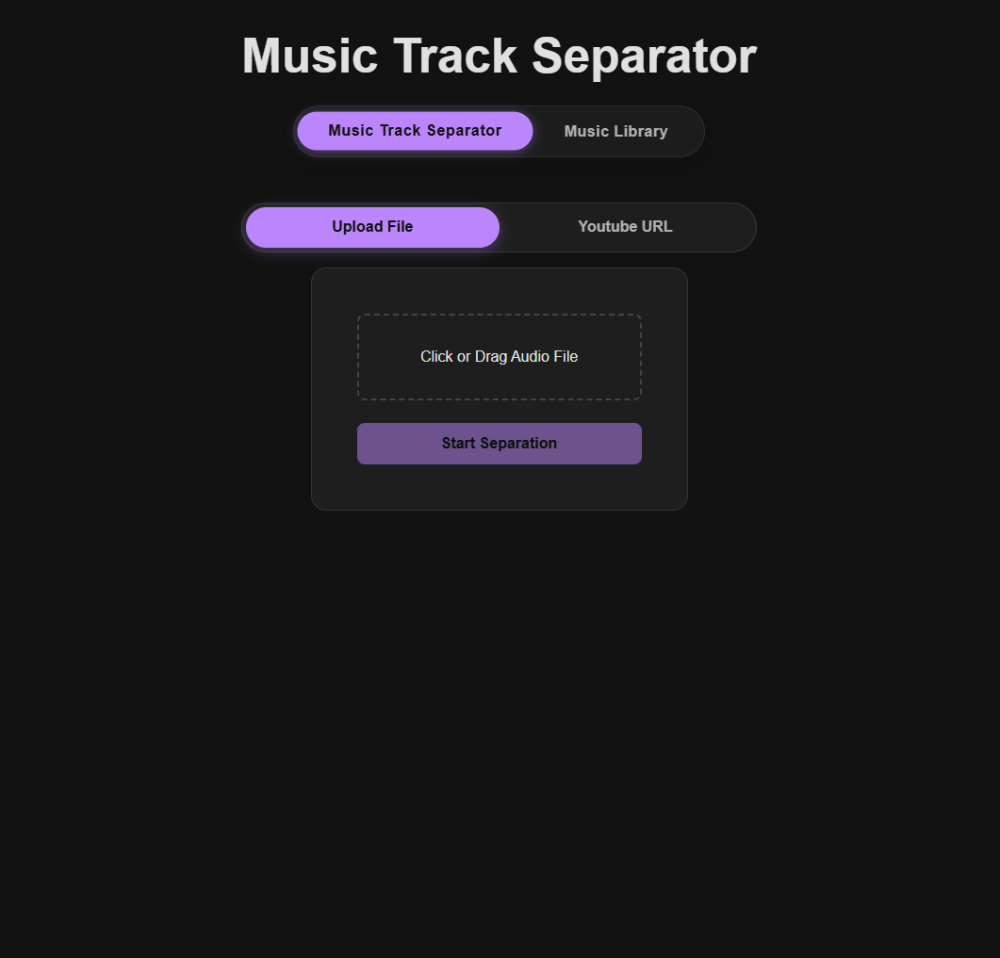
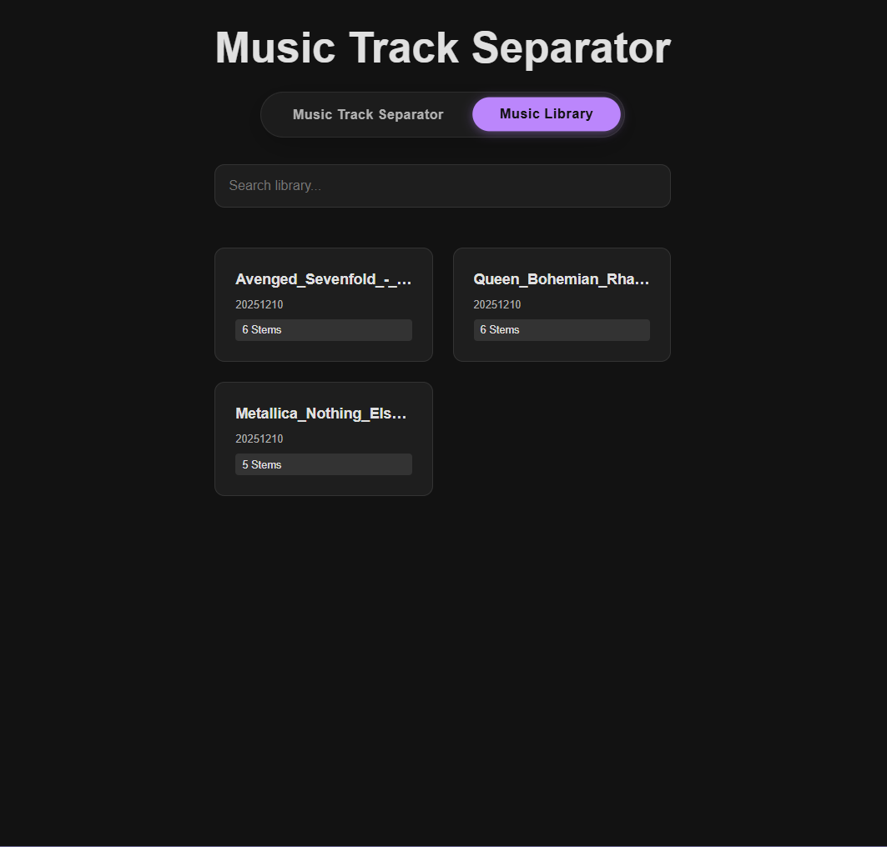
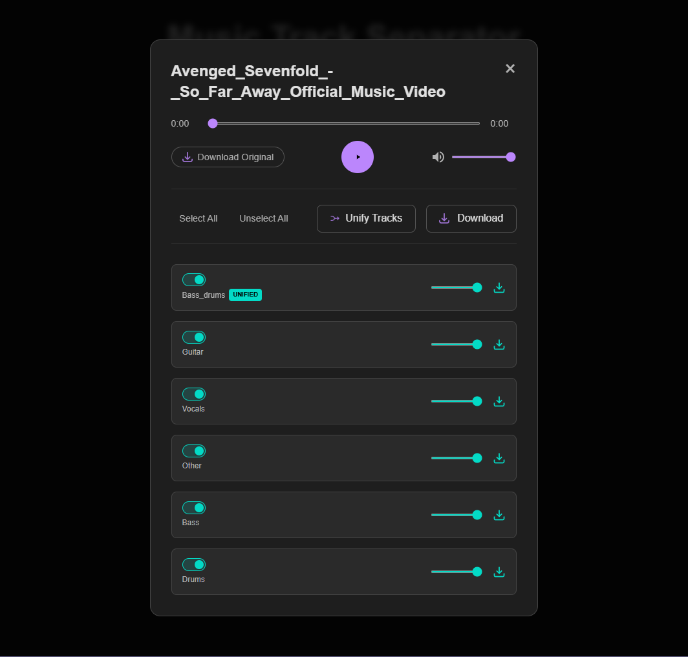

# Music Track Separator

A powerful web application for separating audio tracks from music files or YouTube videos. This project uses AI models to deconstruct audio into individual stems (vocals, drums, bass, other).

## 🏗️ Architecture

The system is built as a full-stack application:

- **Frontend**: React (Vite) for the user interface.
- **Backend**: Flask (Python) for API handling and audio processing.
- **AI Core**: Meta's [Demucs](https://github.com/facebookresearch/demucs) model for high-quality source separation.
- **Utilities**: `yt-dlp` for YouTube downloads and `ffmpeg` for audio mixing.

## ✨ Features

- **Upload & Separate**: Support for `.wav`, `.mp3`, `.ogg`, `.flac`.
- **YouTube Integration**: separate audio directly from YouTube links.
- **Stem Player**: Listen to individual isolated tracks.
- **Mixer**: Create custom mixes by combining specific stems.
- **Unify Tracks**: Combine multiple selected stems into a new single track for download or listening.
- **Download**: Export individual stems, the original file, a custom selection as ZIP, or the full separated package.
- **Global Volume**: Control master volume alongside individual stem volumes.
- **History**: Access previously processed tracks.

## 📸 Screenshots

### Home & Upload


### Music Library


### Player Modal


## 🚀 Quick Start

### Prerequisites

- Node.js & npm
- Python 3.8+
- [FFmpeg](https://ffmpeg.org/download.html) (must be in your system PATH)

### Running the Application

You need to run both the backend and frontend servers.

**1. Start the Backend:**

```bash
cd backend
# Create virtual environment (optional but recommended)
python -m venv .venv
# Windows:
.venv\Scripts\activate
# Linux/Mac:
source .venv/bin/activate

# Install dependencies
pip install -r requirements.txt

# Run the server
python app.py
```

The backend runs on `http://localhost:5000`.

**2. Start the Frontend:**

```bash
cd frontend
npm install
npm run dev
```

The frontend runs on `http://localhost:5173`.

## 📂 Project Structure

- `backend/`: Flask API and audio processing logic.
- `frontend/`: React application.
- `uploads/`: Temporary storage for uploaded/downloaded files.
- `output/`: Processed audio results (stems).

For more detailed documentation, check the [Backend README](./backend/README.md) and [Frontend README](./frontend/README.md).
