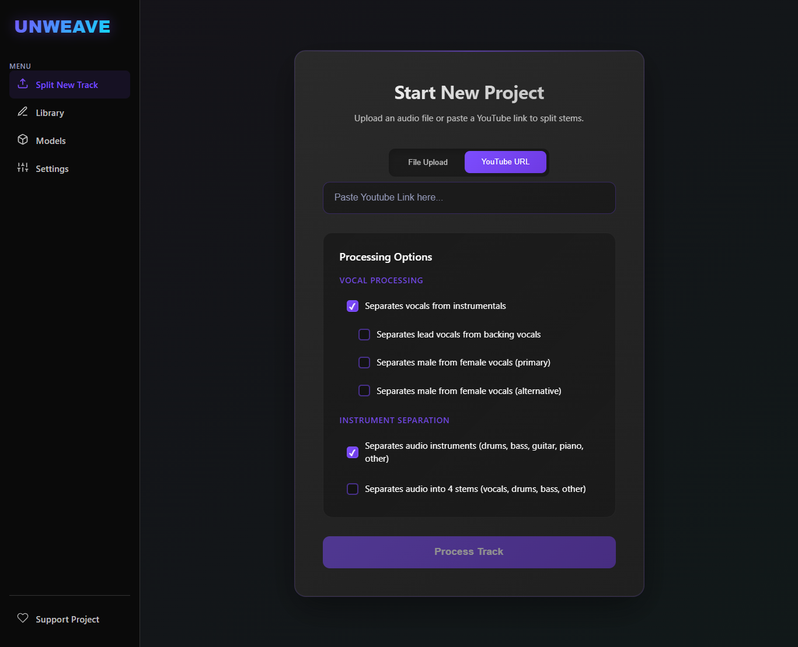
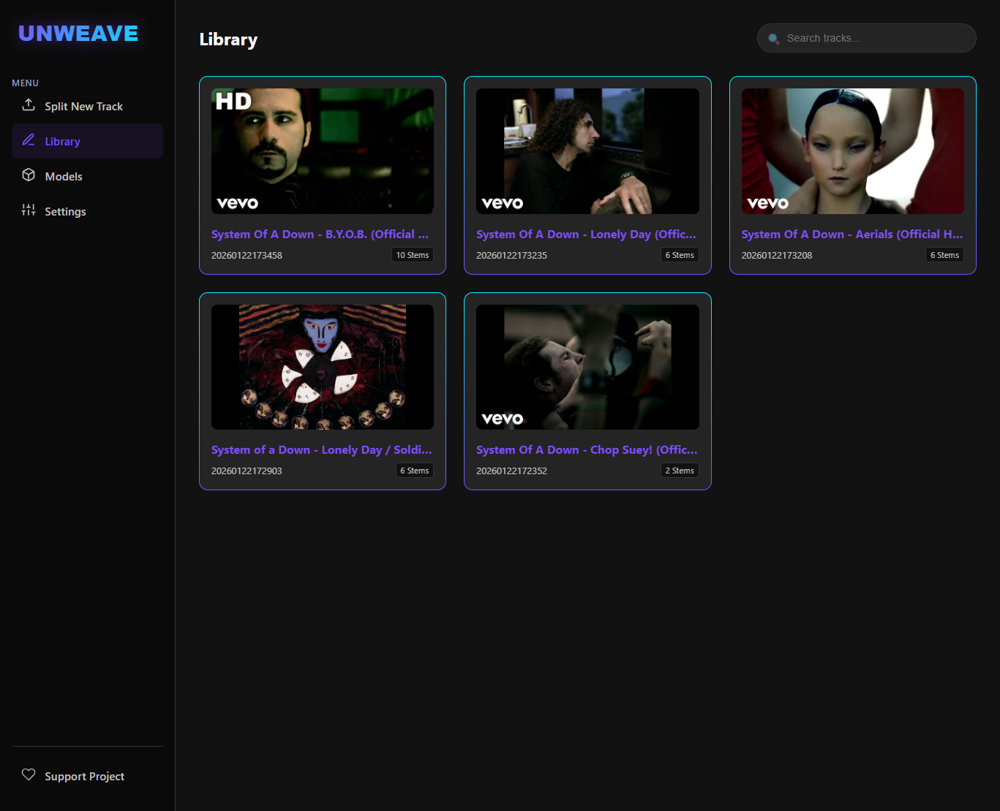
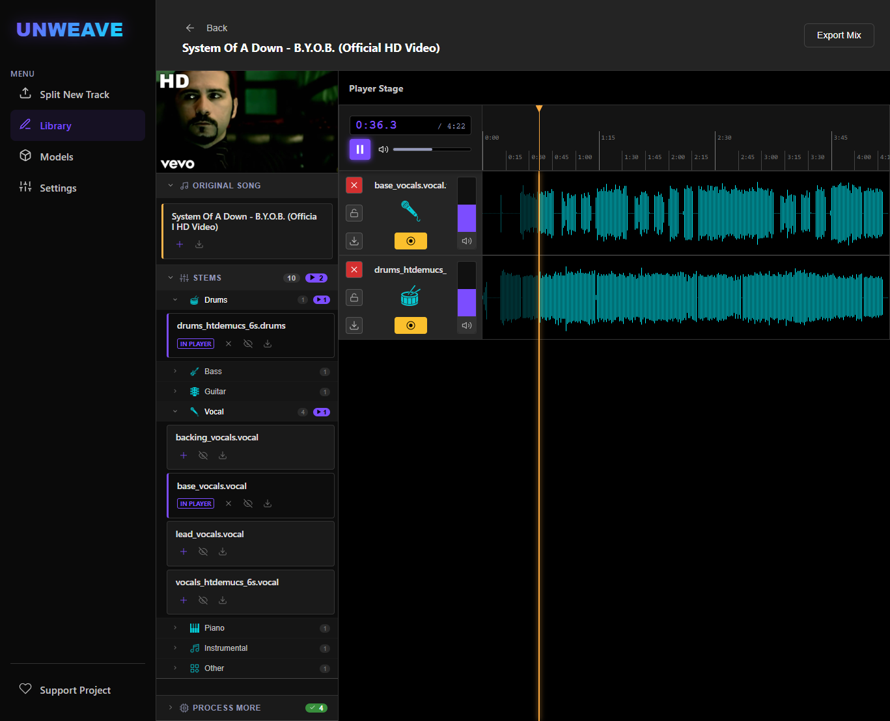

# Unweave

**Unweave** is a powerful AI-driven audio separation and processing web application. It allows users to separate stems (vocals, drums, bass, etc.) from audio tracks and YouTube videos using state-of-the-art models, all through a modern web interface.

## Preview

<table align="center">
<tr>
    <td align="center" colspan="2">
      
      <br/>
      <em>Home / Upload View</em>
    </td>
    <td align="center">
      
      <br/>
      <em>Project Library</em>
    </td>
    <td align="center">
      
      <br/>
      <em>Audio Editor Workspace</em>
    </td>
  </tr>
</table>

## Features

- **Audio Separation**: Separate tracks into stems using advanced models (e.g., Demucs, MDX-Net via `audio-separator`).
- **URL Processing**: Download and process audio directly from YouTube and other supported platforms.
- **Project Management**: Auto-saving projects with detailed metadata and history.
- **Real-time Updates**: Live progress tracking via Server-Sent Events (SSE).
- **GPU Acceleration**: Built-in support for CUDA hardware acceleration.
- **Post-Processing**: Unify specific stems or run additional processing modules on existing projects.

## Prerequisites

Before running the project, ensure you have the following installed:

- **Python**: Version 3.10 or higher.
- **Node.js**: Version 18 or higher.
- **FFmpeg**: Shared libraries are required.
    - *Windows*: The project uses `static-ffmpeg` to auto-provision, but having system FFmpeg is recommended as a fallback.
- **CUDA Toolkit** (Optional): Version 12.x recommended for GPU acceleration on NVIDIA cards.

## Quick Start

### 1. Backend Setup

The backend is built with Flask and Python.

1. Navigate to the backend directory:
   ```bash
   cd backend
   ```

2. Create and activate a virtual environment:
   ```bash
   # Windows
   python -m venv .venv
   .venv\Scripts\activate

   # Linux/Mac
   python3 -m venv .venv
   source .venv/bin/activate
   ```

3. Install dependencies:
   ```bash
   pip install -r requirements.txt
   ```
   *Note: This will install PyTorch with CUDA 12.4 support by default.*

4. Start the API server:
   ```bash
   python api.py
   ```
   The backend will start at `http://127.0.0.1:5000`.

### 2. Frontend Setup

The frontend is built with React and Vite.

1. Open a new terminal and navigate to the frontend directory:
   ```bash
   cd frontend
   ```

2. Install dependencies:
   ```bash
   npm install
   ```

3. Start the development server:
   ```bash
   npm run dev
   ```
   The application will be accessible at `http://localhost:5173`.

## Architecture Overview

- **Backend**: Flask API handling audio processing, file management, and state persistence. Uses `audio-separator` for ML tasks.
- **Frontend**: React application for the user interface, communicating with the backend via REST API and SSE for real-time status.
- **Storage**: Projects are stored in `backend/output/` by default.
